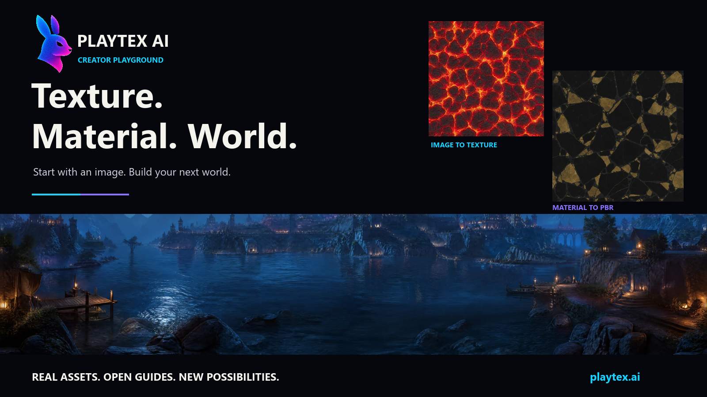
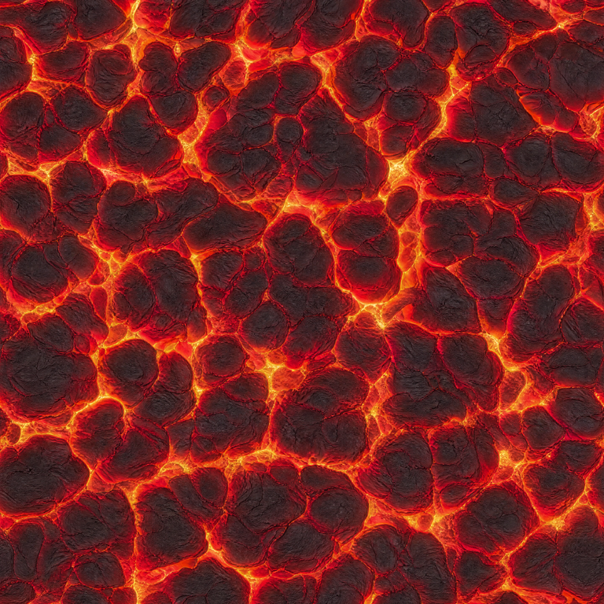
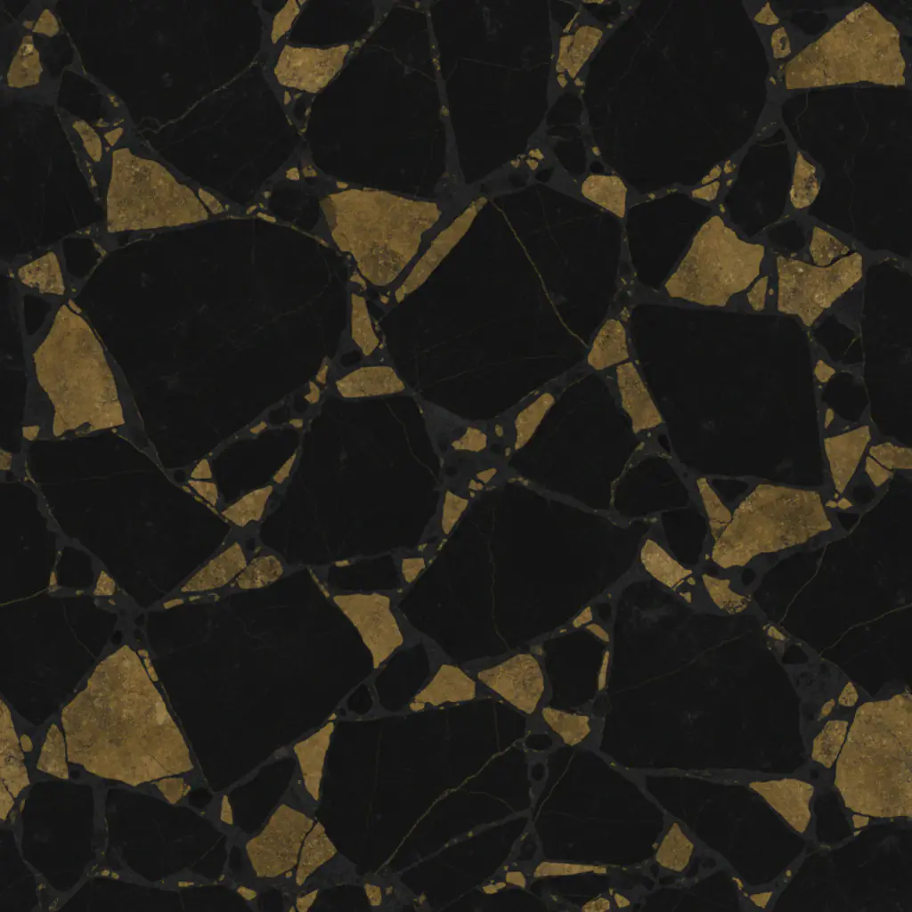
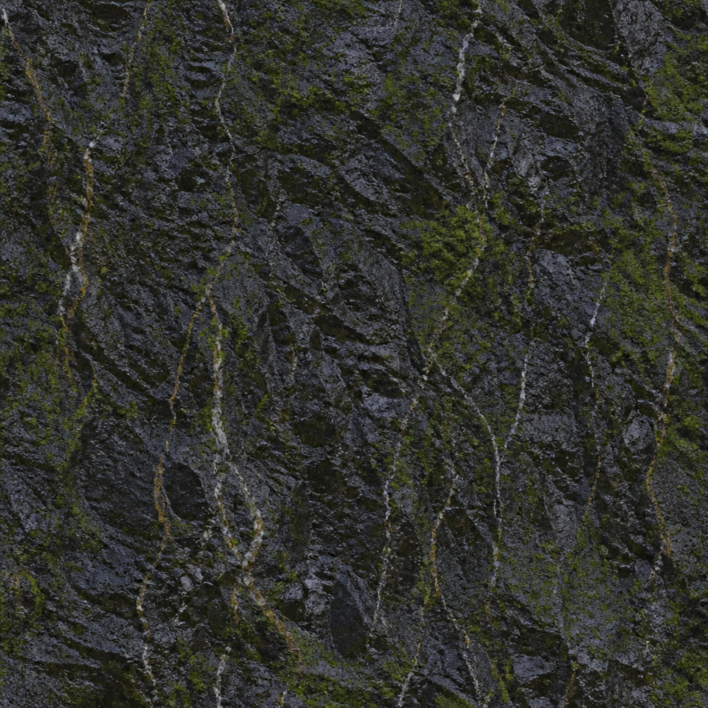
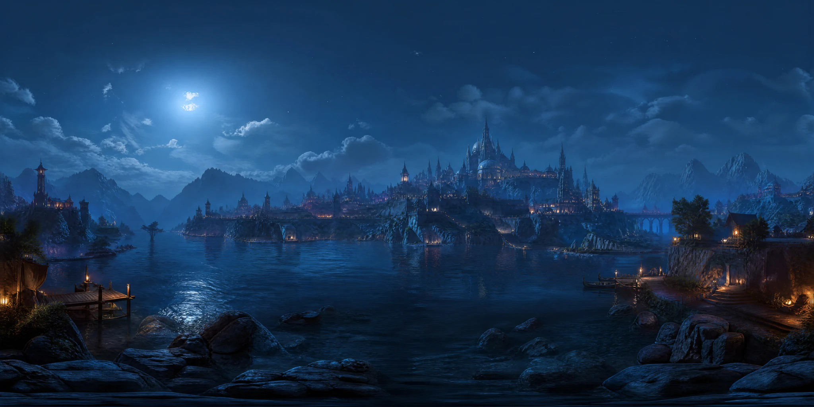
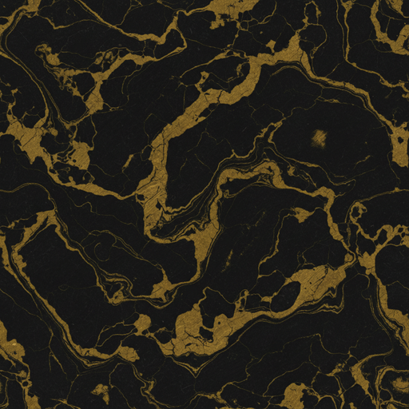
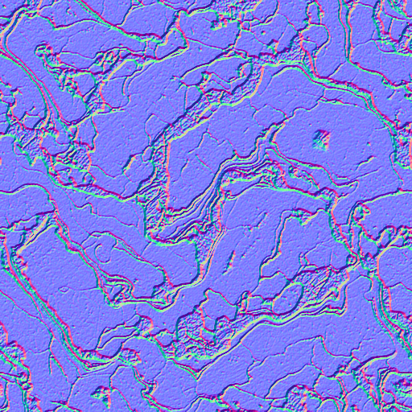
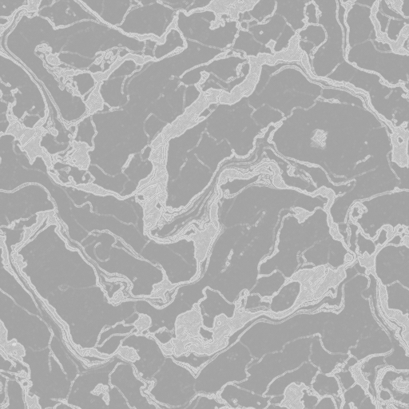
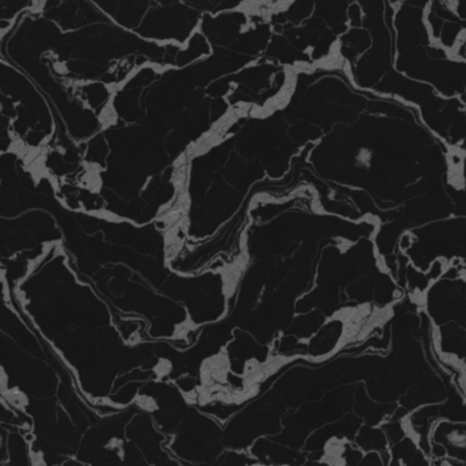

# PLAYTEX AI — Image to Texture, Image to PBR & Skybox Generator Guides

**Your next world starts with a surface.** This is the PLAYTEX AI Creator Playground: practical workflows, real product examples, a downloadable finished PBR material, and creative challenges for game developers and 3D artists.

[**Try PLAYTEX AI ↗**](https://www.playtex.ai/?utm_source=github&utm_medium=referral&utm_campaign=creator_playground) · [**Download Black & Gold Marble ↓**](https://github.com/playtex-ai/creator-playground/releases/download/v1.2.0/playtex-ai-black-gold-marble-512.zip) · [**Choose a guide →**](guides/README.md)

PLAYTEX AI offers browser-based image-to-texture, image-to-PBR, material, and skybox workflows. AI-assisted tools create source imagery; the **PBR Map Generator uses deterministic image processing** to derive material maps. This public repository contains documentation and assets. The tools run on the website and their implementation stays private.

## 🧭 What are you making?

| Start with… | Make… | Follow the workflow | Open the tool |
| --- | --- | --- | --- |
| A photo, screenshot, or artwork | A repeatable surface texture | [Image to texture](guides/image-to-texture.md) | [Image to Texture Generator](https://www.playtex.ai/image-to-texture-generator) |
| A prepared surface image | Albedo, normal, roughness, metallic, height, AO, and emission maps | [Image to PBR](guides/image-to-pbr.md) | [PBR Map Generator](https://www.playtex.ai/pbr-map-generator) |
| An existing material texture | A material with reviewed scale, map conventions, and shading | [Material to PBR](guides/material-to-pbr.md) | [PBR Map Generator](https://www.playtex.ai/pbr-map-generator) |
| A scene or lighting idea | A 360° environment panorama | [Skybox generator](guides/skybox-generator.md) | [HDRI Sphere Generator](https://www.playtex.ai/hdri-sphere-generator) |

## ✨ Made with a little texture obsession

<table><tr><td></td><td></td><td></td></tr><tr><td><b>Lava / Image to texture</b></td><td><b>Black & gold / Material inspiration</b></td><td><b>Basalt / Surface detail</b></td></tr></table>

Actual imagery from the PLAYTEX AI website. [See the image-to-texture workflow](https://www.playtex.ai/image-to-texture-generator). Gallery artwork is shown for product illustration; it is not included in the free sample license.

**Build the atmosphere, too.** Explore the [skybox generator workflow](guides/skybox-generator.md) and [HDRI Sphere Generator](https://www.playtex.ai/hdri-sphere-generator). This web preview illustrates the environment; it is not a downloadable HDR light probe.

## 🎁 Download Black & Gold Marble

**[Download the material — 512px ZIP](https://github.com/playtex-ai/creator-playground/releases/download/v1.2.0/playtex-ai-black-gold-marble-512.zip)** · [Browse maps and settings](assets/materials/black-gold-marble)

An actual PLAYTEX AI library material, shown above in Blender Cycles. Get the source texture, **albedo, normal, roughness, metallic, height, and AO**, plus a **Unity metallic/smoothness texture** and the saved settings.

<table><tr><td></td><td></td><td></td><td></td></tr><tr><td>Albedo</td><td>Normal</td><td>Roughness</td><td>Ambient occlusion</td></tr></table>

No sign-up for this GitHub download. This is the existing website sample pack, mirrored unchanged under the [PLAYTEX AI Terms](https://www.playtex.ai/terms). It is excluded from this repository's CC BY license. [Rights and provenance](RIGHTS.md) · [Checksums](SHA256SUMS.txt).

The PBR maps use deterministic image processing. The render uses OpenGL normals and treats the gold-colored veins as dielectric color. [Set up the maps in your engine](guides/engine-handoff.md).

## 🕹️ Make it yours

Give a sci-fi prop, gallery plinth, or dungeon doorway the black-and-gold treatment. Try three lighting setups and compare how the surface reads. [Share your render](https://github.com/playtex-ai/creator-playground/issues/new/choose) with your renderer and normal-map convention.

## 📚 Learn the useful bits

- [Engine handoff: Blender, Unity, Unreal, Godot, Three.js, and Roblox](guides/engine-handoff.md)
- [Common questions: free use, PBR maps, seamless textures, and skyboxes](guides/faq.md)
- [Quick map reference and troubleshooting](guides/map-reference.md)
- [PBR export specification and manifest schema](https://github.com/playtex-ai/playtex-pbr-export-spec)
- [Watch the image-to-texture walkthrough](https://www.playtex.ai/watch/image-to-texture-generator)

## What can PLAYTEX AI do with an image?

Use **Image to Texture Generator** to extract a surface from an image with AI assistance and inspect its repeat. Use **PBR Map Generator** to derive material channels from an approved surface through deterministic processing. Use the **HDRI Sphere Generator** for a 360° environment. These are distinct workflows; an ordinary photo is not a complete measured material or a 360° panorama.

## Reuse, cite, or contribute

Maintained by **PLAYTEX AI**. Reviewed September 30, 2026. [Release notes](CHANGELOG.md) · [Citation](CITATION.cff) · [Contributing](CONTRIBUTING.md) · [Versioned releases](https://github.com/playtex-ai/creator-playground/releases).
