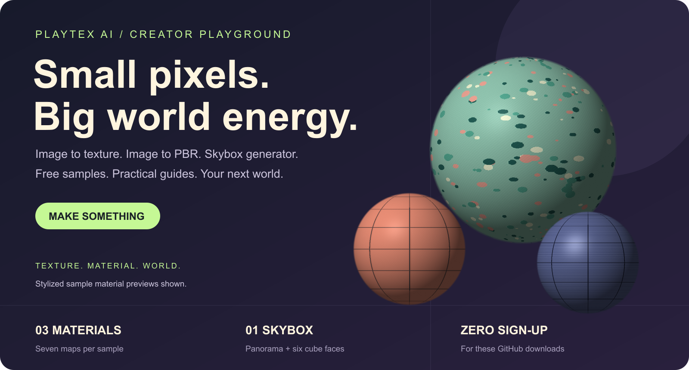
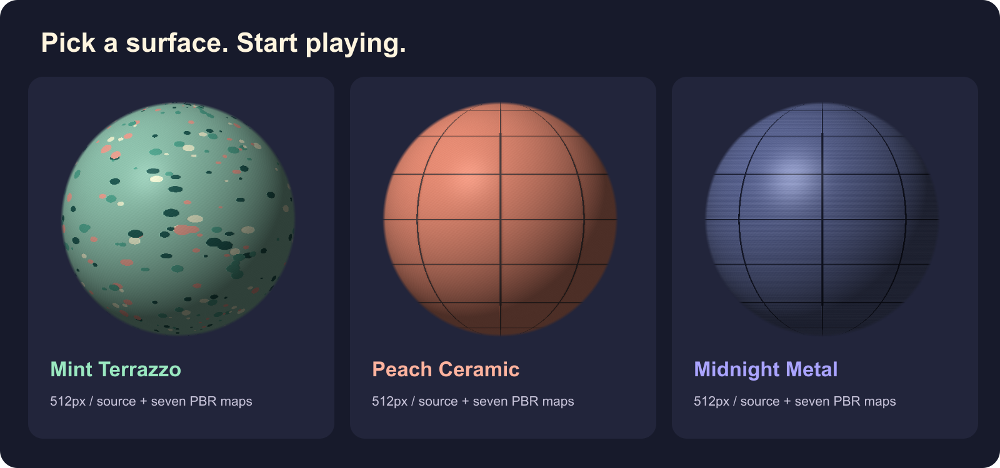
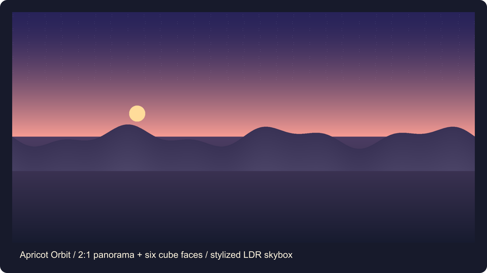

# PLAYTEX AI — Image to Texture, Image to PBR & Skybox Generator Guides

**Your next world starts with a surface.** This is the PLAYTEX AI Creator Playground: practical workflows, free PBR texture samples, a downloadable skybox, and small creative challenges for game developers and 3D artists.

[**Try PLAYTEX AI ↗**](https://www.playtex.ai/?utm_source=github&utm_medium=referral&utm_campaign=creator_playground) · [**Download the free starter pack ↓**](downloads/playtex-ai-starter-pack-v1.zip) · [**Choose a guide →**](guides/README.md)

PLAYTEX AI offers browser-based image-to-texture, image-to-PBR, material, and skybox workflows. AI-assisted tools create source imagery; the **PBR Map Generator uses deterministic image processing** to derive material maps. This public repository contains documentation and assets. The tools run on the website and their implementation stays private.

## 🧭 What are you making?

| Start with… | Make… | Follow the workflow | Open the tool |
| --- | --- | --- | --- |
| A photo, screenshot, or artwork | A repeatable surface texture | [Image to texture](guides/image-to-texture.md) | [Image to Texture Generator](https://www.playtex.ai/image-to-texture-generator) |
| A prepared surface image | Albedo, normal, roughness, metallic, height, AO, and emission maps | [Image to PBR](guides/image-to-pbr.md) | [PBR Map Generator](https://www.playtex.ai/pbr-map-generator) |
| An existing material texture | A material with reviewed scale, map conventions, and shading | [Material to PBR](guides/material-to-pbr.md) | [PBR Map Generator](https://www.playtex.ai/pbr-map-generator) |
| A scene or lighting idea | A 360° environment panorama | [Skybox generator](guides/skybox-generator.md) | [HDRI Sphere Generator](https://www.playtex.ai/hdri-sphere-generator) |

## 🎁 Free assets. Actual files. No sign-up.

| Material | What's included | Download |
| --- | --- | --- |
| [Mint Terrazzo](assets/materials/mint-terrazzo) | 512px source + seven PNG maps + settings | [ZIP](downloads/mint-terrazzo-512.zip) |
| [Peach Ceramic](assets/materials/peach-ceramic) | 512px source + seven PNG maps + settings | [ZIP](downloads/peach-ceramic-512.zip) |
| [Midnight Metal](assets/materials/midnight-metal) | 512px source + seven PNG maps + settings | [ZIP](downloads/midnight-metal-512.zip) |

These original synthetic surfaces were processed with the PLAYTEX AI image-mode PBR core. They are stylized learning materials, not scans or measured physical materials. Sphere images are illustrative previews using the exported albedo and normal detail; they are not product UI captures or full reference PBR renders.

**[Apricot Orbit](assets/skyboxes/apricot-orbit)** — a 2048 × 1024 panorama plus six 512px cubemap faces. [Download skybox ZIP](downloads/apricot-orbit-skybox.zip).

This original authored panorama was converted with the PLAYTEX AI projection core. It is an **LDR background**, not a calibrated HDR light probe or a claimed AI-generator result.

**License:** these sample files are [CC BY 4.0](LICENSE), including commercial use and adaptation with attribution. Example credit: “Material / skybox by PLAYTEX AI — CC BY 4.0; modified.” The GitHub sample offer is separate from account, credit, resolution, and download rules on the live product. [Asset rights and provenance](RIGHTS.md) · [File checksums](SHA256SUMS.txt).

## 🕹️ Make a tiny world

Try the **one room, three surfaces** challenge: tile Peach Ceramic across a floor, use Mint Terrazzo on a countertop, add Midnight Metal to a prop, and put Apricot Orbit behind the scene. Change the tiling scale until the room feels believable. Start emission at zero.

Want feedback? [Share a screenshot or ask for an example](https://github.com/playtex-ai/creator-playground/issues/new/choose). Tell us your renderer, normal convention, and what you changed. Share only work you have permission to publish.

## 📚 Learn the useful bits

- [Engine handoff: Blender, Unity, Unreal, Godot, Three.js, and Roblox](guides/engine-handoff.md)
- [Common questions: free use, PBR maps, seamless textures, and skyboxes](guides/faq.md)
- [Quick map reference and troubleshooting](guides/map-reference.md)
- [PBR export specification and manifest schema](https://github.com/playtex-ai/playtex-pbr-export-spec)
- [Watch the image-to-texture walkthrough](https://www.playtex.ai/watch/image-to-texture-generator)

## What can PLAYTEX AI do with an image?

Use **Image to Texture Generator** to extract a surface from an image with AI assistance and inspect its repeat. Use **PBR Map Generator** to derive material channels from an approved surface through deterministic processing. Use the **HDRI Sphere Generator** for a 360° environment. These are distinct workflows; an ordinary photo is not a complete measured material or a 360° panorama.

## Reuse, cite, or contribute

Maintained by **PLAYTEX AI**. Reviewed September 30, 2026. [Release notes](CHANGELOG.md) · [Citation](CITATION.cff) · [Contributing](CONTRIBUTING.md) · [Versioned releases](https://github.com/playtex-ai/creator-playground/releases).
