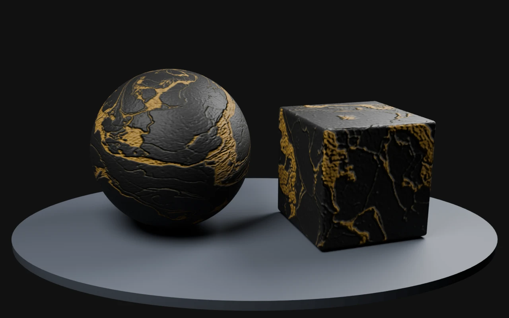

# PLAYTEX AI — Black & Gold Marble

A finished library material with six 512px PBR maps: albedo, normal, metallic, roughness, height, and AO. Also includes the source texture, Unity metallic/smoothness packing, recorded settings, and original README.

The existing PLAYTEX AI sample ZIP is mirrored byte-for-byte. Use is subject to the [PLAYTEX AI Terms](https://www.playtex.ai/terms), not this repository's CC BY license.

Normal: OpenGL (+Y). Use albedo as sRGB and data maps as Non-Color. Gold-colored veins are treated as dielectric color in this example. Preview: Blender Cycles, 32 samples, AgX, normal strength 0.7; no displacement or bloom. Maps were derived with the deterministic PLAYTEX AI PBR core. See settings.json for the source and processing record.
